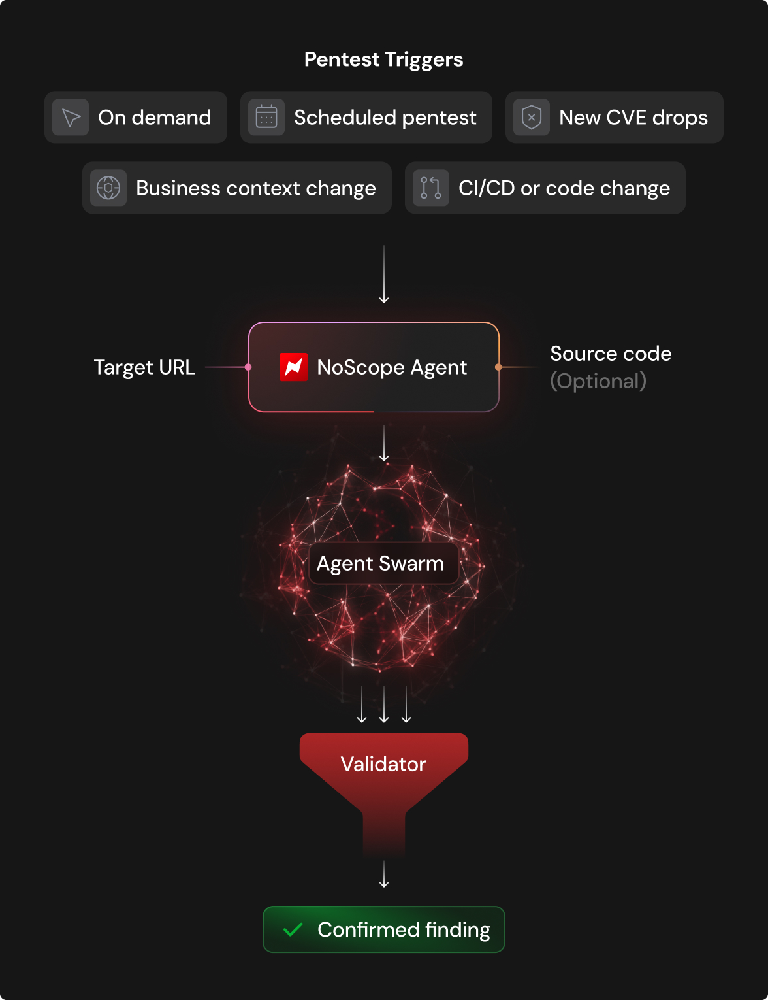

# 📌 NoScope: Finding RCE

## Vulnerability Hunting with NoScope

### What is NoScope?

[NoScope](https://www.noscope.com/) is an AI-based automated pentesting platform. It deploys specialized agents that map an application's attack surface, build an attack graph, generate targeted payloads, and confirm exploitability end-to-end before surfacing anything as a finding. Nothing gets flagged unless it's been proven.

### How Does NoScope Work?

