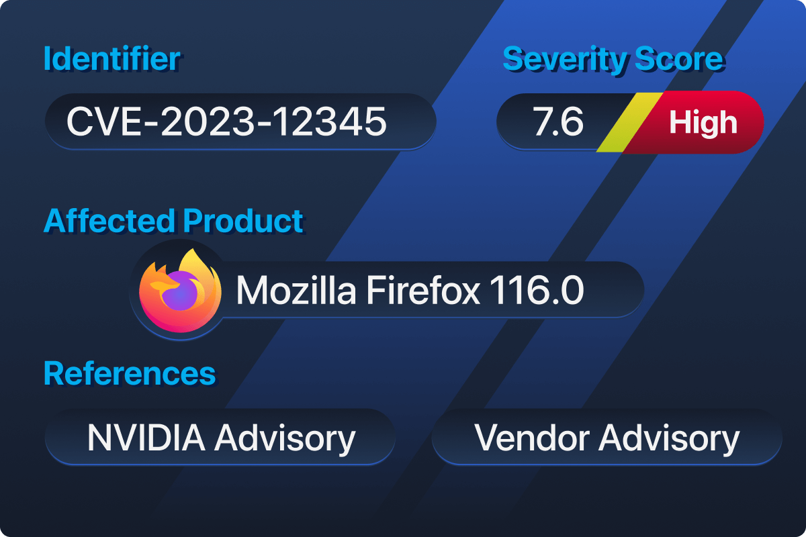

# 📌 Understanding Vulnerability Databases

## Why We Use Vulnerability Databases

## Key Building Blocks

Vulnerability databases use standardised building blocks to describe security issues in a consistent and actionable way. These building blocks ensure that vulnerabilities can be accurately identified, assessed, and referenced across different tools and databases.

#### Vulnerability Identifier (CVE)

A vulnerability identifier uniquely identifies a known security flaw so it can be tracked consistently across tools and databases. The most widely used identifier is the [Common Vulnerabilities and Exposures (CVE) system](https://www.cve.org/), which assigns a unique ID to each vulnerability. For example, CVE-2021-44228 refers to the Log4Shell vulnerability, allowing scanners, databases, and reports to reference the same issue unambiguously.

#### Severity Representation (CVSS)

Severity in vulnerability databases is represented using the [Common Vulnerability Scoring System (CVSS)](https://nvd.nist.gov/vuln-metrics/cvss). CVSS assigns a numerical score that reflects how easily a vulnerability can be exploited and the potential impact if it is successfully abused. For example, a vulnerability with a CVSS score of 9.8 is considered critical and generally requires immediate attention. You can learn more about CVSS ratings in the Vulnerabilities 101 room.

#### Affected Product Identification (CPE)

Vulnerability databases identify affected software using [Common Platform Enumeration (CPE)](https://nvd.nist.gov/products/cpe), which provides a standardised naming format for vendors, products, and versions to clearly define what is vulnerable. For example, instead of stating “Apache is affected,” a CPE entry specifies the exact Apache version that contains the vulnerability.

#### Common Weakness Enumeration (CWE)

Vulnerability databases also classify the underlying weakness that caused a security issue using Common Weakness Enumeration (CWE), which groups vulnerabilities by root cause, helping security professionals understand why a flaw exists, not just what is affected. For example, a vulnerability mapped to CWE-94 (Improper Control of Generation of Code) indicates a code-injection weakness, even if it appears across different products.

### **CVE Numbering Authorities (CNA)**

[CVE Numbering Authorities (CNAs)](https://www.cve.org/programorganization/cnas) are organisations authorised to assign CVE identifiers to newly discovered vulnerabilities. CNAs help scale the CVE program by allowing vendors and organisations to report vulnerabilities in their own products directly. For example, Microsoft, as a CNA, assigns CVE IDs to vulnerabilities affecting Windows or Microsoft services, ensuring these issues are consistently tracked across the CVE List and other vulnerability databases.

### Vulnerability Metadata

In addition to identifiers and severity scores, vulnerability entries include metadata such as a technical description, reference links, and remediation information. This data helps users understand the vulnerability and locate trusted guidance. For example, a CVE entry may include links to vendor advisories or security research explaining how to patch the issue.

### Severity vs Risk

Severity describes the technical impact of a vulnerability, while risk considers how that vulnerability affects a specific environment. Risk depends on factors such as system exposure, usage, and business importance. Example: A high-severity vulnerability on an isolated test system presents lower risk than a medium-severity vulnerability on an internet-facing production server.

## Types of Vulnerability DBs: CVE List

## Types of Vulnerability DBs: National Vulnerability Database (NVD)

[NVD](https://nvd.nist.gov/vuln/search)

## Types of Vulnerability DBs: Other Public VDBs

[Exploit-Database](https://www.exploit-db.com/search)

