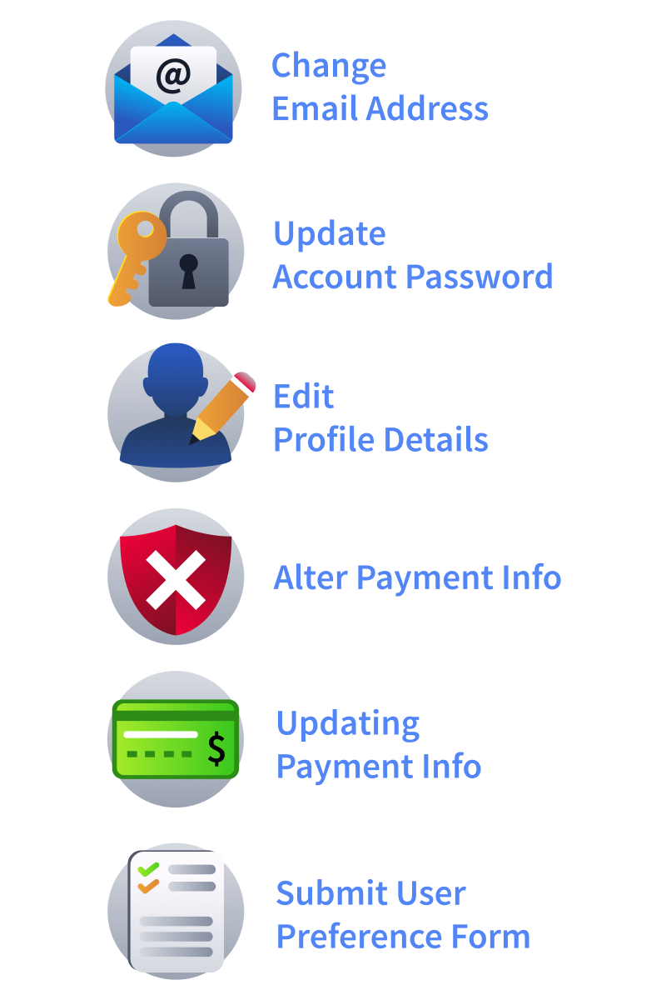

# 📌 CSRF Introduction

## What is CSRF

**CSRF** is a web vulnerability where an attacker tricks a user’s browser into sending a request to a website where the user is already authenticated. Because the browser automatically includes session cookies with every request, the web application assumes the request was made intentionally by the user.

## Why CSRF Works?

Key Conditions for a CSRF Attack

For a CSRF attack to work, three main conditions usually have to exist:

1. The victim must be authenticated to the target application.
2. The application must perform a state-changing action such as updating settings or modifying account data.
3. The application must not verify whether the request came from a trusted source.

## Finding CSRF Vulnerabilities

### Common Features Vulnerable to CSRF

## Exploiting using HTML Form

## Exploitation over Weak Tokens

## Best Practices

After learning how CSRF vulnerabilities can be exploited, it is important for pentesters to know how to efficiently identify them during an assessment. The following practices can help you quickly spot potential CSRF weaknesses while testing web applications.

Key Practices
Best practices for testing CSRF.

1. Focus on state-changing requests: Prioritise requests that modify data, such as password changes, email updates, account settings, or financial transactions. These endpoints are the most common targets for CSRF attacks.
2. Inspect requests for CSRF tokens: Check whether sensitive actions include a CSRF token. If no token exists, or if the token appears static or predictable, the request may be vulnerable.
3. Analyse HTTP methods: Sensitive actions should typically use POST requests. If important operations are performed through GET requests, they may be easier to exploit using images or simple links.
4. Test the requests outside of the application: Copy the request and try to reproduce it from an external HTML page. If the action succeeds without additional verification, the endpoint is likely vulnerable to CSRF.
5. Observe cookie behaviour: Check whether authentication relies only on session cookies. If the application automatically accepts requests containing the session cookie without validating the request origin, CSRF attacks become possible.