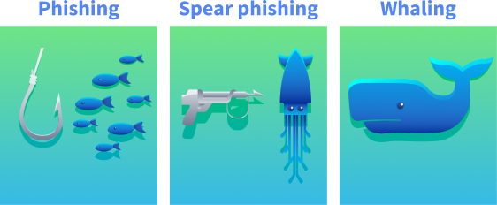

# 📌 Phishing Basics

## Phishing 101

### What Is Phishing?

Phishing is a form of cyber attack that uses social engineering to trick people into revealing sensitive information or running malware on their devices. Attackers deceive victims by impersonating legitimate sources via emails, text messages, phone calls, or fake websites. Phishing exploits human psychology rather than technical vulnerabilities. Attackers craft believable narratives and apply pressure tactics to manipulate victims into compromising their security. The primary channels for phishing attacks include email, SMS (known as smishing), voice calls (vishing), and fake websites designed to look legitimate. Through phishing, attackers aim for financial gain, unauthorised access to sensitive data, or the installation of malware on a victim's device.

### Types of Phishing



#### Phishing

Phishing is the scam's broad, "cast a wide net" version. Attackers send the same believable message to many people at once, often using common themes like account alerts or invoices. These messages feel routine rather than personal; any details are generic or slightly off. The aim is quick wins at scale: stolen passwords, card details, or a foothold on a device.

#### Spear Phishing

Spear phishing is a targeted attack tailored to a specific person. The goal is usually to get the target to click a link, open a file, run a task, or submit credentials so the attacker can move deeper into the organisation's network.

#### Whaling

Whaling is spear phishing that targets senior decision-makers and executives, like CEOs and CFOs. Both spear phishing and whaling are targeted and customised attacks; the distinction is who is targeted and what leverage is expected. Spear phishing can hit anyone whose access enables a foothold (IT, finance, HR, project teams). Whaling concentrates on people whose decision-making power can move money, expose regulated data, or override controls.

In penetration testing, phishing is essential in evaluating an organisation's vulnerability to social engineering attacks. By simulating these attacks, pentesters can uncover human weaknesses within an organisation. Assessing the risks associated with successful phishing attacks, like data breaches or malware infections, helps organisations gauge their exposure and prepare defences against real threats.

Ethical hackers design mock emails that closely resemble real threats during phishing penetration tests without causing any harm. They may target specific groups based on their roles within the organisation. Tools track response metrics such as open and click-through rates, providing valuable insights into employee behaviour. Incorporating phishing into penetration testing reveals an organisation’s susceptibility to social engineering and strengthens its cyber security posture over time.

## Psychology of Phishing

### Social Engineering Principles

### Scarcity

Scarcity makes something feel rare, which pushes people to act before they think. Psychologically, FOMO (fear of missing out) and loss aversion kick in: we dislike losing a chance more than we like gaining a benefit. We can use terms like “limited seats,” “last chance,” or “ends today.”

Example: “Only three TryPhones up for grabs.”

### Urgency

Urgency adds a countdown so the brain prioritises speed over scrutiny. Time pressure narrows attention and reduces deliberate checking, especially when the consequence sounds inconvenient (lockouts, delays). Language often includes “within 24 hours,” “immediately,” or “deadline passed.”

Example: “Your account will be suspended in 12 hours unless you verify your identity through this portal.”

### Authority

Authority leans on perceived status or expertise to gain quick compliance. People are more likely to follow instructions if they think they come from leaders, experts, or official departments. Visual cues (titles, signatures, formal tone) and role labels (HR, IT, Finance) increase the effect.

Example: “From: IT Administrator. Action required on your SSO settings.”

### Fear

Fear uses threat and alarm to trigger a protective reaction, pushing people to “fix” the problem immediately. Anxiety can override usual scepticism, especially when the risk sounds personal (account compromise, legal trouble). Wording often includes “security alert,” “breach,” or “unauthorised access.”

Example: “We detected suspicious logins on your account. Secure it immediately here.”

### Curiosity

Curiosity hooks attention by promising interesting information. The brain wants to close information gaps, which can outweigh caution when the tease feels relevant or exclusive. Subject lines are short, intriguing, and slightly vague.

Example: “Confidential: Q3 roadmap highlights.”

### Trust

Trust piggybacks on familiar brands, colleagues, or communication styles so the message feels safe by default. Recognisable names, logos, or routines (monthly reports, ticket numbers) lower scepticism and make requests seem routine.

Example: “Microsoft 365: New security notice available in your portal,” or a message that looks like it’s from a known teammate asking for a quick review.

### Cognitive Biases

Cognitive bias is the tendency to make decisions based on feelings, assumptions, or past experiences instead of facts. These biases increase the risk of falling for phishing scams.

- Overconfidence bias: Many people, especially cyber security practitioners, think they're too smart to fall for phishing scams. However, this overconfidence can lead to less vigilance when checking suspicious messages.

- Confirmation bias: This happens when people accept information that fits their expectations. For instance, if someone is waiting for an email from their bank, they might trust a phishing email that pretends to be from the bank without verifying it.

- Authority bias: This leads people to trust messages from those they see as authority figures without question. An email that comes from a high-ranking official is more likely to be trusted than one from an unknown source.

## Phishing Techniques

### URL and Domain Manipulation

- URL Masking: Involves disguising a malicious URL behind a legitimate-looking hyperlink. For example, an attacker might display https://tryhackme.com while redirecting users to http://phisher.thm.
- Homograph Attacks: Exploit visual similarities between domain name characters, for example, replacing "o" with "0" or using Cyrillic characters. An attacker might register a domain like go0gle.com that looks identical to the legitimate one but redirects users to a malicious site.
- Typosquatting: Involves registering domains similar to legitimate ones, relying on users making typing errors, for example, tryhacme.com instead of tryhackme.com. As a pentester, you can use these domains for phishing websites or malware delivery.

### Tools of the Trade

Pentesters use specific tools to create and manage realistic phishing campaigns. Below are three of the most popular tools:

[GoPhish](https://github.com/gophish/gophish) is a web-based framework that makes setting up phishing campaigns more straightforward. It allows you to store your SMTP server settings for sending emails and has a web-based tool for creating email templates using a simple WYSIWYG (What You See Is What You Get) editor. You can also schedule emails and have an analytics dashboard that shows open and click rates. You can get some hands-on experience with GoPhish in our Phishing room.

[EvilNginx](https://github.com/kgretzky/evilginx2) is a tool designed for advanced phishing campaigns that bypass multi-factor authentication (MFA). It acts as a reverse proxy between victims and legitimate sites, capturing credentials and session tokens in real time.

[The Social Engineering Toolkit (SET)](https://github.com/trustedsec/social-engineer-toolkit) contains many tools. Still, some of the important ones for phishing are the ability to create spear-phishing attacks and deploy fake versions of common websites to trick victims into entering their credentials. In task 6, we will get hands-on experience with this tool.

## Anatomy of Phishing Campaign

#### Planning & Scoping

Start by agreeing on the mission with the client and writing it down in one sentence. Define which user groups are in or out, the techniques in bounds, and the specific outcomes to measure, for example, separating “clicked a link” from “attempted to submit credentials.” Set the campaign timing and message volume, secure legal sign-off, and record the rules of engagement, an explicit kill switch, and emergency contacts so the exercise remains authorised, safe, and reversible.

#### Reconnaissance

Use only public information to make lures feel plausible without crossing privacy lines. Company websites, press releases, LinkedIn profiles, public social posts, and relevant news provide enough context to craft believable pretexts, such as referencing a recent announcement or policy change. Keep all collections within scope and document sources so it’s clear the research stayed ethical and limited to OSINT.

#### Scenario & Payload Development

Turn the intel into realistic but harmless messages: an invoice reminder, an IT notification, or an HR update that looks and reads like the real thing. Payloads should support learning, not exploitation: tracking links, branded landing pages that capture metadata, and benign attachments are appropriate. Avoid malware and live credential capture entirely; use simulated login pages and fake accounts to measure risk-free behaviour.

#### Exploitation and Post-Exploitation

Run the campaign according to the agreed plan, either in staggered waves or as a single send, and monitor opens, clicks, simulated submissions, and reports in real time. Keep the kill switch and escalation path visible to the team and pause immediately if messages leak outside the scope or trigger unintended consequences. Use lab-safe tooling, such as GoPhish or an equivalent sandboxed platform, and only target real users after obtaining prior written authorisation.

#### Reporting and Debriefing

Analyse what happened and why: click rates, submission attempts, reporting behaviour, and timing across teams. Present findings without naming individuals and focus on practical improvements like targeted training, phishing-resistant MFA, SPF/DKIM/DMARC configuration, and other technical controls that reduce risk, close with agreed follow-up actions and a sensible cadence for re-testing so progress can be measured over time. The table below provides an overview of the most common metrics used during phishing campaigns, along with some benchmarks and client recommendations.

### Recommendations table

A phishing simulation provides value only when its results are communicated clearly to the client. The responsibilities of a penetration tester extend beyond the conclusion of the campaign; it is essential to translate raw metrics into actionable findings. The following table offers a framework for this process: given a metric and its benchmark, appropriate recommendations can be formulated. This approach reflects the structure of a professional phishing report.

| Metric                     | What it measures                                       | Benchmark                                            | Suggested Recommendation(s)                                 |
| -------------------------- | ------------------------------------------------------ | ---------------------------------------------------- | ----------------------------------------------------------- |
| Open Rate                  | % of users who opened the email.                       | Industry varies; typical phishing open rates ~50–65% | Targeted refresher training                                 |
| Click Rate                 | % of all users who clicked a link.                     | 8–14% acceptable; >14% high risk                     | Focused security awareness training                         |
| Credential Entry Rate      | % of all users who entered credentials after clicking. | <2% low risk; 2–5% moderate risk; >5% high risk      | Phishing site identification training, MFA implementation   |
| Attachment Detonation Rate | % of users who opened/executed an attachment.          | No formal benchmark; >5–7% suggests risk             | Educate on safe handling of attachments, Sandbox detonation |
| Reporting Rate (24h)       | % of users who reported the email within 24h.          | >40% strong; 30–40% average; <30% low                | Reporting awareness campaign                                |

## The Social Engineering Toolkit

### Scenario

After our OSINT investigation, we have finally identified a good target for our spear-phishing attack: Bob, the head of finance at TryAccounting. Through LinkedIn, we found this email address: bob@tryaccounting.thm. In one of their job offers for a cyber security engineer, we learnt that they:

Have a strict password policy (can be used as a good pretext in our phishing email)
Use email security, so we might need to perform some basic email spoofing
Our goal is to obtain Bob's credentials, so we will create a phishing web app to harvest them.

### Preparing the Attack

First, SSH into the VM with the following credentials:

#### Credentials

Username: attacker
Password: attacker1234
IP address: 10.48.130.225
Connection via:
SSH: ssh attacker@10.48.130.225

Next, we need to run the Social Engineering Toolkit. There is an alias on the VM to make things easier: Just type SET and hit enter.

As you can see, we can choose from several modules. For this practical, we will set up a credential harvester with custom HTML. This will allow us to set up a phishing site using our own HTML.

Select the first option, Social-Engineering Attacks:

```bash
attacker@tryhackme$ SET
Select from the menu:

   1) Social-Engineering Attacks
   2) Penetration Testing (Fast-Track)
   3) Third Party Modules
   4) Update the Social-Engineer Toolkit
   5) Update SET configuration
   6) Help, Credits, and About

  99) Exit the Social-Engineer Toolkit

set 1
```

Next, we will select the second option, Website Attack Vectors, and then the third option, Credential Harvester Attack Method:

```bash
 Select from the menu:

   1) Spear-Phishing Attack Vectors
   2) Website Attack Vectors
   3) Infectious Media Generator
   4) Create a Payload and Listener
   5) Mass Mailer Attack
   6) Arduino-Based Attack Vector
   7) Wireless Access Point Attack Vector
   8) QRCode Generator Attack Vector
   9) Powershell Attack Vectors
  10) Third Party Modules

  99) Return back to the main menu.

set 2

 1) Java Applet Attack Method
   2) Metasploit Browser Exploit Method
   3) Credential Harvester Attack Method
   4) Tabnabbing Attack Method
   5) Web Jacking Attack Method
   6) Multi-Attack Web Method
   7) HTA Attack Method

  99) Return to Main Menu

set 3
```

Choose the third option, Custom Import, so we can use our own HTML file. During a real campaign, we would use the "Site Cloner" option to create a realistic copy of our target's web app. When prompted for an IP address for the POST back, ensure that the IP is the same as 10.48.130.225:

```bash

   1) Web Templates
   2) Site Cloner
   3) Custom Import

  99) Return to Webattack Menu

set 3

set:webattack IP address for the POST back in Harvester/Tabnabbing [10.10.189.116]:

```

Then, provide the following path for index.html /home/attacker/setoolkit/ and choose the first option, Copy just the index.html. And finally, enter the following URL: http://tryacounting.thm, and press enter:

```bash
[!] Example: /home/website/ (make sure you end with /)
[!] Also note that there MUST be an index.html in the folder you point to.
set:webattack Path to the website to be cloned: /home/attacker/setoolkit/
[*] Index.html found. Do you want to copy the entire folder or just index.html?

1. Copy just the index.html
2. Copy the entire folder

Enter choice [1/2]: 1
[-] Example: http://www.blah.com
## Redirection site after the victim triggers
set:webattack URL of the website you imported: http://tryacounting.thm

The best way to use this attack is if username and password form fields are available. Regardless, this captures all POSTs on a website.
[*] The Social-Engineer Toolkit Credential Harvester Attack
[*] Credential Harvester is running on port 80
[*] Information will be displayed to you as it arrives below:
```

#### Leave your terminal window open, since this is where we will capture our target's credentials.

Notice the intentional typo in the domain: one "c" is missing. In a phishing engagement, having control of a typosquatted domain can help maximise our chances of success. You should see output indicating that your Credential Harvester is running on port 80. We can view the result by accessing http://10.48.130.225 in our browser:

A cloned TryAccounting login page hosted on the attacker's machine, showing the credential harvester running on port 80

### Time to Get Phishy

The next step will be to create and send our phishing email. Head over to http://10.48.130.225:8080 via your Attackboxes browser, and log in to the Rainloop client with the following email attacker@phisher.thm and the password attacker1234.

During our reconnaissance phase, we discovered that TryAccounting may use email security. If we try to send an email to our target, bob@tryaccounting.thm, we will get the following response:

An email delivery failure response showing TryAccounting's email security blocking the spoofed message sent from the attacker's address

In Rainloop, we can use aliases to help us with basic spoofing.

Click on the "New Message" button, then in the new email, click on your attacker's email next to the "From" field, and select support@tryaccounting.thm from the dropdown, so we can make it look like we are an employee sending an internal email to bob@tryaccounting.thm:

The Rainloop email client's From field dropdown, showing the support@tryaccounting.thm alias selected for email spoofing

We can use the email below and come up with a convincing subject, for example, "Action Required: Password Expiration Notice"

```bash
Dear Bob,

As part of our security policy, we require all TryAccounting employees to change their passwords every 3 months. Please log in to our internal portal and update your password before Friday:
http://tryacounting.thm
Thank you,
TryAccounting Support Team
```

Finally, we can send this email to Bob. This time, we didn't receive the email security notification. If we go back to our terminal window, we should see their credentials.

```bash
attacker@tryhackme$
[*] WE GOT A HIT! Printing the output:
POSSIBLE USERNAME FIELD FOUND: username=bob.wilkinson
POSSIBLE PASSWORD FIELD FOUND: password=**\*\***\*\*\***\*\***
[*] WHEN YOU'RE FINISHED, HIT CONTROL-C TO GENERATE A REPORT.
```

Congratulations on performing a successful spear phishing attack!
